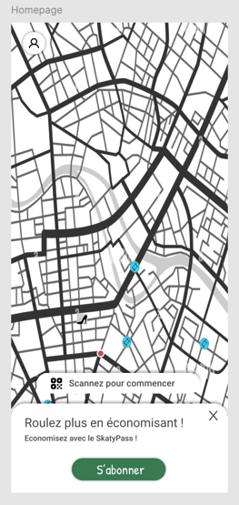

# 🛹 Sketchy — Location de skateboards électriques

Sketchy est une application Android permettant aux utilisateurs de localiser, déverrouiller, rouler et payer leurs trajets en skateboard électrique via une interface cartographique interactive .



---

## 📱 Fonctionnalités principales

- 🔓 Scan QR code pour déverrouiller un skate
- 🗺️ Carte interactive avec skates disponibles (OpenStreetMap)
- ⏱️ Suivi de trajet en temps réel (distance, durée)
- 💸 Calcul dynamique du prix : `1€ + 0,15€/min`
- 📊 Historique des trajets
- 🧾 SkatyPass pour des réductions sur les trajets
- 🧭 Menu latéral avec stats utilisateur (km parcourus, trajets, etc.)

---

## 🚀 Installation

### Prérequis

- Android Studio Arctic Fox ou supérieur
- SDK Android 35+
- Connexion Internet (pour chargement des tuiles OSM)

### Cloner le projet

```bash
git clone https://github.com/sachadvr/sketchy.git
```

### Importer le projet dans Android Studio

1. Ouvrir Android Studio
2. Cliquer sur `File` > `Open...`
3. Sélectionner le dossier du projet cloné
4. Attendre la synchronisation du projet
5. Lancer l'application sur un émulateur ou un appareil Android
6. Enjoy 🎉

### Auteurs
**Mélène Dufrénois** _@melenedufrenois_
**Mehdi Trari** _@mehditrari_
**Sacha Duvivier** _@sachadvr_